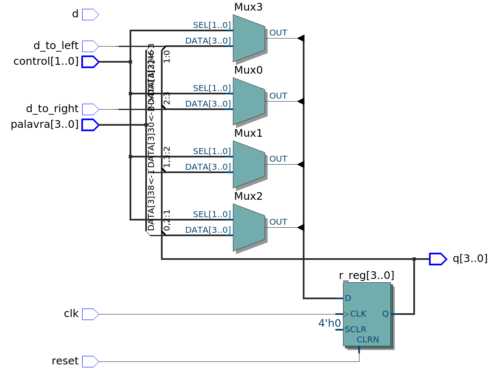

# Registrador de Deslocamento Universal de 4 Bits

A ideia central do exercício é criar um circuito baseado em flip-flops D que registre a operação de um **bit shift** (deslocamento de bits), tanto para a esquerda quanto para a direita. 

Para isso, é necessário ter controle sobre:
* **A operação/direção:** para qual lado será o shift, se o circuito vai pausar ou se vai carregar dados.
* **A palavra:** a sequência de bits paralela que será usada para inicializar ou mudar o estado do registrador.

## O Operador de Concatenação (`&`) em VHDL

Em VHDL, o operador **`&`** não realiza cálculos matemáticos; sua função é puramente de fiação (roteamento). Ele serve para "colar" um bit novo ao início ou ao final de um vetor existente. 

Para usá-lo corretamente em deslocamentos, precisamos analisar as fatias (*slices*) do vetor de bits atual para posicionar o bit novo exatamente na posição desejada, descartando o bit que está saindo do registrador.

---

## 1. Deslocamento para a Direita (`when "01"`)

* **Linha do código:** `r_next <= d_to_right & r_reg(3 downto 1);`

### Valores do Teste:
* `d_to_right = 1` (novo bit que vai entrar pela esquerda)
* `r_reg = 1010` (valor que já estava registrado na memória)

### Passo a Passo da Operação:
1. **Isolamento da fatia:** O código analisa o argumento `r_reg(3 downto 1)`. No vetor `1010`, os bits nas posições 3, 2 e 1 são os três primeiros bits:
   * `r_reg(3)` é `1`
   * `r_reg(2)` é `0`
   * `r_reg(1)` é `1`
   * *Resultado da fatia:* **`101`** (o bit `0` da posição 0 foi descartado).

2. **Concatenação:** O operador `&` junta o bit de entrada `d_to_right` na frente (à esquerda) da fatia isolada:
   * `r_next <= 1 & 101;`

3. **Atualização:** Na próxima borda de subida do clock, `r_reg` recebe o valor calculado em `r_next`.
   * *Resultado final de `r_reg`:* **`1101`**

---

## 2. Deslocamento para a Esquerda (`when "10"`)

* **Linha do código:** `r_next <= r_reg(2 downto 0) & d_to_left;`

### Valores do Teste:
* `d_to_left = 0` (novo bit que vai entrar pela direita)
* `r_reg = 1010` (valor que já estava registrado na memória)

### Passo a Passo da Operação:
1. **Isolamento da fatia:** O código analisa o argumento `r_reg(2 downto 0)`. No vetor `1010`, os bits nas posições 2, 1 e 0 são os três últimos bits:
   * `r_reg(2)` é `0`
   * `r_reg(1)` é `1`
   * `r_reg(0)` é `0`
   * *Resultado da fatia:* **`010`** (o bit `1` da posição 3 foi descartado).

2. **Concatenação:** O operador `&` junta a fatia isolada com o bit de entrada `d_to_left` no final (à direita):
   * `r_next <= 010 & 0;`

3. **Atualização:** Na próxima borda de subida do clock, `r_reg` recebe o valor calculado em `r_next`.
   * *Resultado final de `r_reg`:* **`0100`**

# Esquemático do circuito: 
