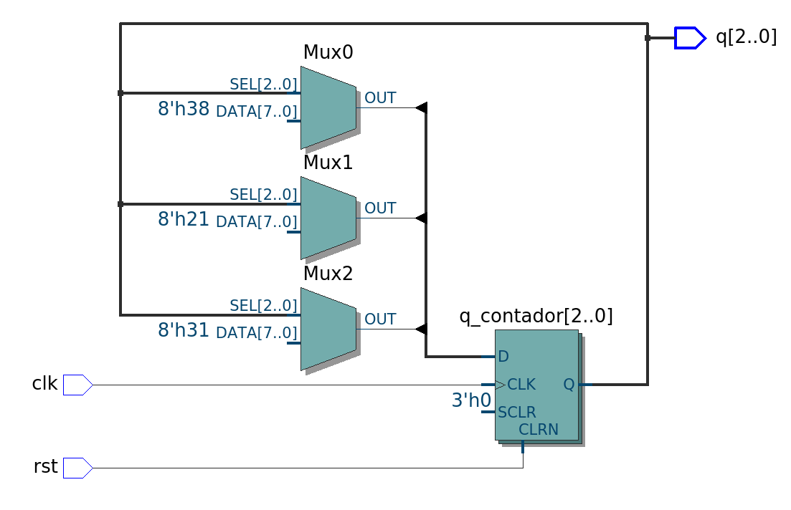

# Entendendo o Contador Sequencial Arbitrário em VHDL
Sabendo que um contador sequencial percorre uma sequência predefinida de estados e que é a lógica do próximo estado que determina os padrões na sequência, implemente um contador que percorre a seguinte a sequência arbitrária “000”, “011”, “100”, “101” e “111”.


## 1. O Propósito do Exercício

O objetivo principal deste projeto é demonstrar como construir uma **Máquina de Estados Síncrona**. Ou seja, com sinal de clock e lógica de registro, proxímo estado e output.

Neste exercício, a sequência exigida foi arbitrária: **"000" $\rightarrow$ "011" $\rightarrow$ "100" $\rightarrow$ "101" $\rightarrow$ "111"**. 

Para que o hardware execute esse salto customizado, o projeto foi dividido em duas funções principais de hardware:
1. **Memória (Os Flip-Flops):** Guarda o número que está aceso na tela no momento presente. (Lógica de regitro)
2. **Lógica Combinacional (As Portas Lógicas):** Fica lendo o número presente e calcula "matematicamente" qual deve ser o próximo número da lista. (Lógica do próximo estado)


## 2. A Diferença entre Entidade e Arquitetura no VHDL

Ao programar em VHDL, nós não estamos escrevendo software; estamos descrevendo um chip físico. Por isso, a linguagem divide o código em duas partes estritas: a **Entidade (`entity`)** e a **Arquitetura (`architecture`)**.

### A Entidade:
A `entity` descreve apenas a parte externa do chip que estamos disposição
* **Entradas (`clk`, `rst`):** São pinos que recebem sinais de entrada
* **Saídas (`q`):** O pino que enviam sinais de saída

> **O Problema do pino de saída (`out`):** No VHDL, um pino declarado como `out` funciona como uma rua de mão única para fora do chip. O circuito interno não consegue "ler" o que está passando por esse pino. Por isso declaramos signais dentro da arquitetura.

### A Arquitetura 
A `architecture` descreve tudo o que acontece dentro do chip que estamos implementando. É aqui que declaramos os nossos **Sinais Internos (`signals`)**. Esses sinais em si não são pinos externos que estão expostos para o uso, isso é papel da entidade, mas são usados internamente na implementação do circuito interno.

## 3. O Papel dos Sinais Internos: `q` vs `q_contador` vs `d_contador`

Como o nosso circuito precisa "olhar" para o valor atual para conseguir prever o futuro (qual é o próximo número da sequência), nós não podemos usar a porta externa `q` que é a saída do chip, pois ela não pode ser lida internamente, podemos dizer qual valor ela irá assumir para a saída, mas não tem como ler ela de dentro do circuito.

A solução é criar fios internos para fazer o circuito funcionar, fazer com que tenha o fio de retorno, igual fazemos nos desenhos a mão com portas lógicas e multiplexadores:

* **`q_contador` (O Presente):** É o fio interno que guarda a saída atual dos flip-flops. Toda a lógica de controle pode ler este fio sem problemas para saber em qual estado o contador está.
* **`d_contador` (O Futuro):** É o fio interno que carrega o resultado do cálculo. Quando o circuito decide qual é o próximo estado, ele coloca esse valor em `d_contador` e o deixa estacionado na entrada dos flip-flops, esperando o pulso de relógio (`clk`). Ou seja, esse sinal é resultado de q (estado presente naquele clock) ter passado pela lógica do próximo estado gerando o valor d, que no próximo clock será o próximo q e assim sucessivamente.


### O que conecta essa implementação interna com o exterior do chip
```vhdl
q <= q_contador;
```
>Essa parte do código que conecta nossa lógica do próximo estado com a saída q declarada na entidade.

# Esquemático do circuito:
