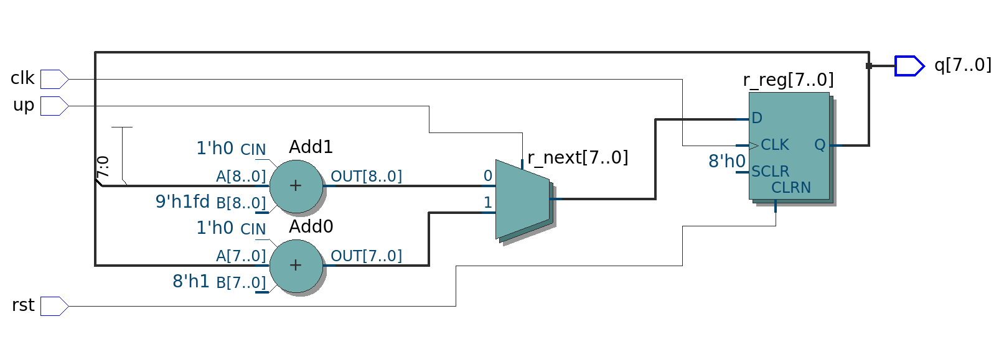

# Contador Binário Up/Down de 8 Bits

A ideia central do exercício é criar um circuito baseado em flip-flops D que registre a operação de uma contagem binária aritmética de 8 bits (valores de 0 a 255), capaz de alternar entre ordem crescente e decrescente. Utilizamos o controle do sinal UP que entra no circuito.

## 1. Operação de Incremento (`up = '1'`)

* **Linha do código:** `r_next <= r_reg + 1;`

### Valores do Teste:
* `up = '1'` (sinaliza que a contagem deve ser crescente)
* `r_reg = "00000011"` (valor decimal **3** registrado na memória)

### Passo a Passo da Operação:
1. **Análise da Condição:** O processo combinacional detecta que o sinal `up` está em nível lógico alto (`'1'`).
2. **Cálculo da Soma:** O circuito somador interno pega o valor atual contido no fio `r_reg` e adiciona uma unidade:
   * `r_next <= "00000011" + 1;`
   * *Resultado do cálculo:* **`"00000100"`** (valor decimal **4**).
3. **Atualização:** Na próxima borda de subida do clock (`rising_edge(clk)`), o registrador mostra o fio `r_next`.
   * *Resultado final de `r_reg` (e da saída `q`):* **`"00000100"`**

---

## 2. Operação de Decremento (`up = '0'`)

* **Linha do código:** `r_next <= r_reg - 1;`

### Valores do Teste:
* `up = '0'` (sinaliza que a contagem deve ser decrescente)
* `r_reg = "00000011"` (valor decimal **3** registrado na memória)

### Passo a Passo da Operação:
1. **Análise da Condição:** O processo combinacional detecta que o sinal `up` mudou para nível lógico baixo (`'0'`).
2. **Cálculo da Subtração:** O circuito subtrator interno assume o controle, pega o valor estável de `r_reg` e subtrai uma unidade:
   * `r_next <= "00000011" - 1;`
   * *Resultado do cálculo:* **`"00000010"`** (valor decimal **2**).
3. **Atualização:** Na próxima borda de subida do clock, os flip-flops transferem esse valor calculado para a saída estável.
   * *Resultado final de `r_reg` (e da saída `q`):* **`"00000010"`**

---

## 3. O Caso Especial de Estouro: Underflow

* **Condição limite:** Contador está em `"00000000"` (decimal **0**) e o sinal `up = '0'`.

### Passo a Passo da Operação:
1. Ao realizar a operação `r_next <= r_reg - 1`, o circuito tenta subtrair `1` de um vetor completamente zerado.
2. Como o registrador é limitado fisicamente a 8 bits e do tipo `unsigned`, ocorre o efeito de **Underflow** (estouro para baixo).
3. O circuito rotaciona e assume o maior valor possível para 8 bits.
   * *Resultado em `r_next`:* **`"11111111"`** (valor decimal **255**).
- Utilizamos os unsigned para não gerar valores negativos e trabalhar somente com um binário "puro", mas nada impede de mudar a forma com que interpretamos esse binário afim de também trabalhar com somas e subtrações de números negativos.

# Esquemático do circuito
